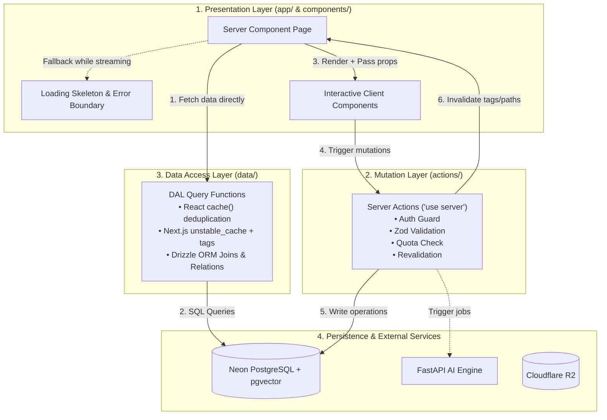

# StudySync — Application Architecture & Development Standard

> **Purpose:** This document establishes the official, production-ready engineering standards for StudySync. Every page, component, server action, query, and cache layer must follow this pattern to maintain consistency, maintainability, performance, and upgradability across the entire lifecycle of the project.

---

## 1. High-Level Architectural Flow

StudySync enforces a strict **4-layer architectural boundary**:



---

## 2. Directory Structure Standards

All frontend code must be placed according to this layout:

```text
frontend/
├── actions/                  # Server Actions for MUTATIONS ONLY (Create/Update/Delete)
│   ├── courses.ts            # Course creation, update, deletion
│   ├── documents.ts          # Document deletion, retry triggers
│   └── ...
├── data/                     # Data Access Layer (DAL) for READ QUERIES ONLY
│   ├── courses.ts            # getCoursesForUser, getCourseById, getCourseStats
│   ├── documents.ts          # getDocumentsForCourse
│   └── ...
├── types/                    # Shared TypeScript interfaces, types & Zod schemas
│   ├── action-result.ts      # Standard ActionState / ActionResult contract
│   ├── course.ts             # Course DTOs & CourseFormSchema
│   └── ...
├── app/                      # Next.js App Router
│   ├── (auth)/               # Auth route group
│   ├── dashboard/            # Course dashboard (/dashboard)
│   │   ├── page.tsx          # Server Component entry point
│   │   ├── loading.tsx       # Suspense fallback skeleton
│   │   └── error.tsx         # Route error boundary
│   └── courses/[courseId]/   # Course workspace sandbox
│       ├── layout.tsx        # Persistent Course Shell layout
│       ├── page.tsx          # Course Overview
│       ├── documents/        # PDF management
│       ├── chat/             # AI Grounded Chat
│       ├── flashcards/       # Flashcards Deck & Study Mode
│       └── quizzes/          # MCQ Practice Quizzes
├── components/
│   ├── ui/                   # Reusable base design primitives (shadcn)
│   ├── dashboard/            # Dashboard feature-scoped components
│   │   ├── course-card.tsx
│   │   ├── course-grid.tsx
│   │   ├── create-course-dialog.tsx
│   │   └── dashboard-stats.tsx
│   └── courses/              # Course shell & feature components
└── db/                       # Drizzle ORM schema & client
```

---

## 3. Standard #1: Page Creation Pattern

### Rules:
1. **Server Components by Default:** Pages (`page.tsx`) must be async React Server Components. Never mark a page as `"use client"`.
2. **Next.js 16 Asynchronous Props:** In Next.js 16, `params` and `searchParams` are Promises and must be awaited:
   ```typescript
   export default async function Page({
     params,
     searchParams,
   }: {
     params: Promise<{ courseId: string }>;
     searchParams: Promise<{ query?: string }>;
   }) {
     const { courseId } = await params;
     const { query } = await searchParams;
     ...
   }
   ```
3. **Session Authentication Guard:** Guard the page at the very top using `getServerSession()`. Redirect immediately if unauthenticated.
4. **Direct DAL Querying:** Fetch data by directly invoking the Data Access Layer (DAL) function. Never fetch data through client `useEffect` or through internal API routes when in a Server Component.
5. **Streaming with Suspense & Skeletons:** Use `loading.tsx` or wrap heavy sections in `<Suspense fallback={<Skeleton />}>` for optimal Core Web Vitals and instant First Contentful Paint.
6. **Pass Data Down to Pure Client Components:** Pass serializable data from the Server Component to interactive Client Components (e.g. modals, filters, dropdowns).

### Canonical Page Template:

```tsx
// app/dashboard/page.tsx
import { Suspense } from "react";
import { redirect } from "next/navigation";
import { getServerSession } from "@/lib/get-session";
import { getCoursesForUser } from "@/data/courses";
import { CourseGrid } from "@/components/dashboard/course-grid";
import { DashboardHeader } from "@/components/dashboard/dashboard-header";
import { CourseGridSkeleton } from "@/components/dashboard/course-grid-skeleton";

export const metadata = {
  title: "Dashboard",
  description: "Manage your courses and learning workspaces.",
};

export default async function DashboardPage() {
  const session = await getServerSession();

  if (!session?.user) {
    redirect("/auth/sign-in?redirectTo=/dashboard");
  }

  // Fetch initial data via DAL
  const courses = await getCoursesForUser(session.user.id);

  return (
    <main className="container mx-auto max-w-7xl px-4 py-8 sm:px-6 lg:px-8">
      <DashboardHeader user={session.user} courseCount={courses.length} />
      
      <Suspense fallback={<CourseGridSkeleton />}>
        <CourseGrid courses={courses} />
      </Suspense>
    </main>
  );
}
```

---

## 4. Standard #2: Data Access Layer (DAL) & Queries

### Rules:
1. **Separation from Mutations:** Read queries live in `data/` and must never contain `"use server"` directives or perform database writes.
2. **Scoping by User / Tenant:** Every query must enforce ownership (`where: eq(table.userId, userId)` or course ownership verification).
3. **Request-Level Memoization:** Wrap DAL functions with React's `cache()` so identical queries called multiple times within a single server render cycle (e.g., in a layout and a child page) execute only once.
4. **Multi-Request Caching via `unstable_cache`:** For expensive aggregation queries, wrap with Next.js `unstable_cache` and supply explicit cache tags (`courses:${userId}`).

### Canonical DAL Template:

```typescript
// data/courses.ts
import { cache } from "react";
import { db } from "@/db";
import { courses, documents, flashcardDecks, quizzes } from "@/db/schema";
import { eq, desc, count } from "drizzle-orm";
import type { CourseWithStats } from "@/types/course";

/**
 * Fetch all courses belonging to a user with aggregated statistics.
 * Request-memoized using React cache().
 */
export const getCoursesForUser = cache(async (userId: string): Promise<CourseWithStats[]> => {
  const userCourses = await db.query.courses.findMany({
    where: eq(courses.userId, userId),
    orderBy: [desc(courses.updatedAt)],
    with: {
      documents: {
        columns: { id: true, status: true },
      },
      flashcardDecks: {
        columns: { id: true },
      },
      quizzes: {
        columns: { id: true },
      },
    },
  });

  return userCourses.map((c) => ({
    id: c.id,
    title: c.title,
    description: c.description,
    color: c.color,
    createdAt: c.createdAt,
    updatedAt: c.updatedAt,
    documentCount: c.documents.length,
    deckCount: c.flashcardDecks.length,
    quizCount: c.quizzes.length,
  }));
});
```

---

## 5. Standard #3: Server Actions & Mutations

### Rules:
1. **File Directive:** Must begin with `"use server"`.
2. **Session Authentication:** Always verify the active session before performing any action.
3. **Schema Validation:** Always validate incoming parameters using a Zod schema. Never trust raw client arguments.
4. **Business & Quota Enforcement:** Check plan limits (e.g., max 5 courses for Free plan) inside the action before database insertion.
5. **Standardized Return Type:** Always return a typed `ActionResult<T>`:
   ```typescript
   export type ActionResult<T = unknown> =
     | { success: true; data: T; error?: never; fieldErrors?: never }
     | { success: false; error: string; fieldErrors?: Record<string, string[]>; data?: never };
   ```
6. **Targeted Cache Invalidation:** Call `revalidatePath(...)` or `revalidateTag(...)` on success.
7. **Safe Error Handling:** Catch unexpected exceptions and return user-friendly messages without leaking internal database stack traces.

### Canonical Server Action Template:

```typescript
// actions/courses.ts
"use server";

import { getServerSession } from "@/lib/get-session";
import { db } from "@/db";
import { courses } from "@/db/schema";
import { count, eq } from "drizzle-orm";
import { revalidatePath } from "next/cache";
import { createCourseSchema, type CreateCourseInput } from "@/types/course";
import type { ActionResult } from "@/types/action-result";

const MAX_FREE_COURSES = 5;

export async function createCourse(input: CreateCourseInput): Promise<ActionResult<{ id: string }>> {
  // 1. Authenticate
  const session = await getServerSession();
  if (!session?.user?.id) {
    return { success: false, error: "You must be signed in to create a course." };
  }

  // 2. Validate Input
  const parsed = createCourseSchema.safeParse(input);
  if (!parsed.success) {
    return {
      success: false,
      error: "Invalid course details. Please review the highlighted fields.",
      fieldErrors: parsed.error.flatten().fieldErrors,
    };
  }

  try {
    // 3. Enforce Quota
    const existing = await db
      .select({ value: count() })
      .from(courses)
      .where(eq(courses.userId, session.user.id));
    
    const courseCount = existing[0]?.value ?? 0;
    if (courseCount >= MAX_FREE_COURSES) {
      return {
        success: false,
        error: `Free tier limit reached. You can create up to ${MAX_FREE_COURSES} active courses.`,
      };
    }

    // 4. Execute Mutation
    const [newCourse] = await db
      .insert(courses)
      .values({
        userId: session.user.id,
        title: parsed.data.title.trim(),
        description: parsed.data.description?.trim() || null,
        color: parsed.data.color,
      })
      .returning({ id: courses.id });

    // 5. Invalidate Cache
    revalidatePath("/dashboard");

    return { success: true, data: { id: newCourse.id } };
  } catch (err) {
    console.error("[createCourse] Unexpected error:", err);
    return {
      success: false,
      error: "Failed to create course. Please try again.",
    };
  }
}
```

---

## 6. Standard #4: Caching & Revalidation Strategy

| Mechanism | Purpose | Scope | Invalidation Method |
| :--- | :--- | :--- | :--- |
| **React `cache()`** | Deduplicate repeated queries within the same request lifecycle (e.g. Layout + Page). | Single HTTP request | Cleared automatically at end of request |
| **`revalidatePath(path)`** | Purge the Next.js Data Cache and router cache for a specific route after a mutation. | Path-scoped | Triggered inside Server Actions |
| **`revalidateTag(tag)`** | Granular multi-request invalidation for shared entity caches across pages. | Tag-scoped (`courses:${userId}`) | Triggered inside Server Actions |
| **Optimistic Updates** | React 19 `useOptimistic` or client state update for zero-latency UI responsiveness. | Client view | Reconciled when Server Action settles |

---

## 7. Standard #5: Component Design & Separation

1. **Stateful vs Presentational:**
   - Presentational components (e.g., `CourseCard`, `StatBadge`) are pure, accept props, and contain no side-effects.
   - Interactive components (e.g., `CreateCourseDialog`, `DeleteCourseDialog`) handle form submission, loading states (using React 19 `useTransition` or `isPending`), and trigger toast notifications (`sonner`).
2. **Feedback & Telemetry:**
   - Loading states must disable buttons and show spinners.
   - Mutations must trigger feedback via `toast.success()` or `toast.error()`.
3. **Accessibility:**
   - Use Radix UI / shadcn dialogs with proper `aria-labelledby`, focus trapping, and keyboard navigation.

---

## 8. Summary Checklist for Any New Feature

When creating any new page or domain slice in StudySync:
- [ ] Define the domain types, DTOs, and Zod schemas in `types/<domain>.ts`.
- [ ] Write the read queries in `data/<domain>.ts` wrapped in React `cache()`.
- [ ] Write the mutation actions in `actions/<domain>.ts` with `"use server"`, auth guard, validation, and revalidation.
- [ ] Build the Server Component page in `app/.../page.tsx` with async `params` and direct DAL query.
- [ ] Add `loading.tsx` skeleton and `error.tsx` boundary.
- [ ] Build modular, accessible client components in `components/<feature>/`.
