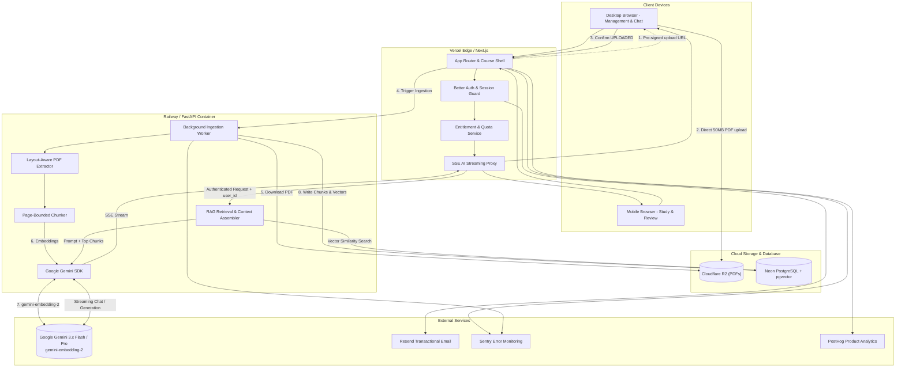
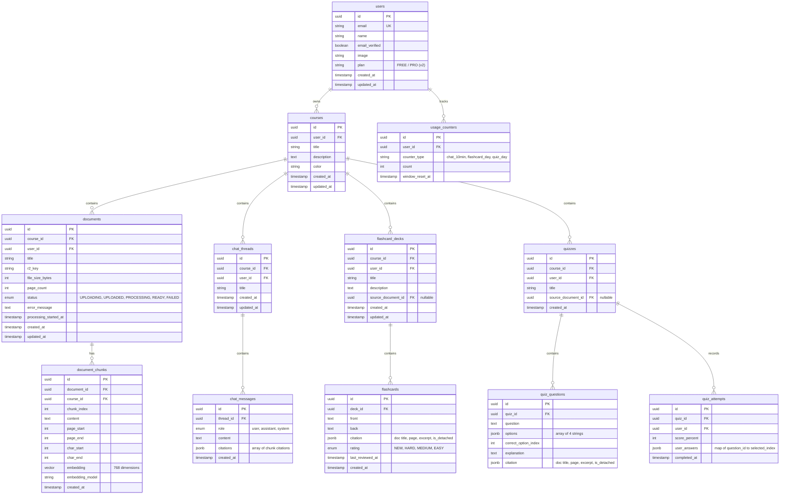
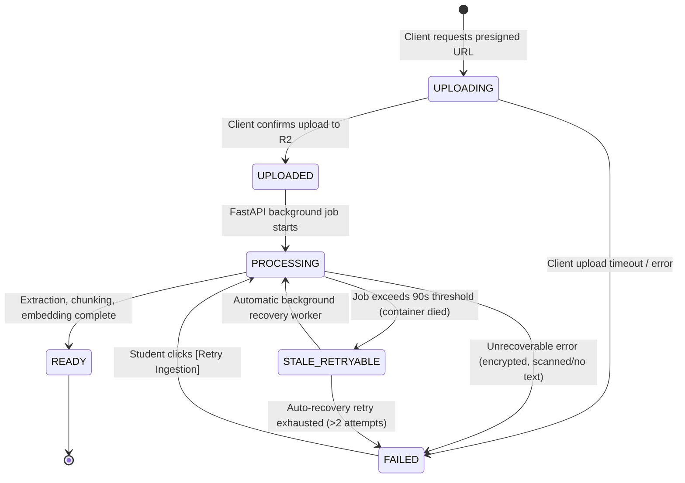

# StudySync — Master Technical Implementation Plan

> **Role & Purpose:** Master architectural specification and step-by-step implementation guide for building **StudySync**, a course-grounded AI study platform. This document serves as the single source of truth across all 17 phases of development.

---

## 1. Executive Summary & Product Architecture

StudySync is a modern web application designed for university students to organize digital course materials (PDF lecture slides, handouts, and notes) and actively study from them via grounded AI.

### Core Principles
1. **Grounded Over Generative:** AI responses, flashcards, and quizzes must be directly derived from and cited against the student's uploaded materials.
2. **Course-Centric Hierarchy:** Workspaces are strictly scoped by course/subject. Retrieval queries never leak across courses or users.
3. **Dedicated Surfaces (Desktop vs. Mobile):**
   * **Desktop:** The creation and management environment (PDF upload, document ingestion management, multi-thread chat, citation inspection).
   * **Mobile:** The active study environment (full-viewport flashcard flipping, practice quiz taking, quick chat).
4. **Lean MVP & Direct Cost Protection:** 100% free in v1, with aggressive quota protection, mandatory email verification before ingestion, and zero unneeded queue infrastructure.



---

## 2. System Boundaries & Service Responsibilities

### Next.js (`apps/web`) — Vercel
* **Primary App & Auth:** App Router, UI components, Better Auth session management.
* **Email Verification Barrier:** Hard gate blocking unverified accounts from creating courses or uploading PDFs.
* **API Gateway & Authorization:** Validates `course.user_id === session.user.id` on every operation.
* **Direct Upload Issuer:** Generates S3-compatible pre-signed upload URLs for Cloudflare R2.
* **Entitlement & Quota Service:** Authoritative state checks for courses, documents, chat messages, and generation limits.
* **SSE Proxy:** Securely proxies authenticated Server-Sent Events from FastAPI to the browser.

### FastAPI (`apps/api`) — Railway
* **Private Network Execution:** Never exposed directly to public internet; accessible only via internal secret token (`X-Internal-Secret`) from Next.js.
* **Document Ingestion Engine:** Downloads original PDF from R2, validates text extraction, performs page-bounded chunking, and persists vectors into `pgvector`.
* **RAG Orchestrator:** Handles embedding generation, vector similarity queries, reranking, and citation mapping.
* **Gemini Client:** Manages calls to Gemini 3.x Flash (with Pro fallback), JSON schema constraints for flashcards/quizzes, and streaming.
* **Background Tasks:** Executes asynchronous ingestion via `fastapi.BackgroundTasks` with automated stale job detection.

### Cloudflare R2
* Object storage for raw PDFs at key path: `courses/{course_id}/documents/{document_id}/original.pdf`.
* Zero egress fees; handles direct-from-browser uploads up to 50 MB.

### Neon PostgreSQL + `pgvector`
* Unified relational database and vector store. All tenant data and high-dimensional vectors live in the same DB instance, ensuring ACID transactions and clean cascading deletes.

---

## 3. Database Schema (Neon + Drizzle ORM)



### Key Schema Rules & Indexes
1. **Multi-Column Composite Indexes:**
   * `document_chunks (course_id, document_id)`
   * `chat_messages (thread_id, created_at ASC)`
   * `courses (user_id)`
   * `documents (course_id, status)`
2. **Vector Index:**
   * `document_chunks` using `HNSW` or `IVFFlat` index on `embedding vector_cosine_ops`.
3. **Graceful Deletion Handling:**
   * `documents` delete cascade: Deletes all associated `document_chunks` and queues R2 file purge.
   * `flashcard_decks` and `quizzes` have `source_document_id` set to `ON DELETE SET NULL`. The frontend displays `citation.is_detached = true` with cached snapshot text if source is deleted.

---

## 4. Document Ingestion State Machine & Auto-Recovery



### Ingestion Logic (`apps/api/services/ingestion.py`)
1. **Download:** Fetch raw bytes directly from Cloudflare R2 into memory/temp storage.
2. **Validate:** Inspect PDF structure using `pypdf`/`pdfplumber`. If total extractable text across all pages is under 100 characters, immediately fail with user-facing message: `"This PDF contains no extractable digital text. Scanned PDFs and images are not supported in v1."`
3. **Page-Bounded Chunking:**
   * Iterate page by page (1 to $N$, where $N \le 100$).
   * Chunk size: 500–700 tokens with 50-token overlap *strictly bounded to the page*.
   * Attach metadata: `{ document_id, course_id, page_start: p, page_end: p, chunk_index: i }`.
4. **Embedding Generation:**
   * Call `gemini-embedding-2` in batches of 16 chunks.
   * Exponential backoff with jitter on 429 / 503 errors (3 retries).
5. **Persistence:**
   * Batch insert chunks and vectors into `document_chunks`.
   * Update `documents.status = 'READY'`, `documents.page_count = N`.

---

## 5. RAG & Grounded Citation Engine

### Retrieval Pipeline
1. **User Query:** Incoming question on `/courses/[courseId]/chat/[threadId]`.
2. **Query Vectorization:** Compute embedding via `gemini-embedding-2` (768d).
3. **Filtered Vector Search:**
   ```sql
   SELECT id, document_id, content, page_start, 1 - (embedding <=> :query_embedding) AS similarity
   FROM document_chunks
   WHERE course_id = :course_id
     AND (:doc_filter IS NULL OR document_id = ANY(:doc_filter))
   ORDER BY similarity DESC
   LIMIT 10;
   ```
4. **Context Assembly:**
   * Format top chunks into labeled context blocks:
     `[CHUNK 1 | Document: "Lecture 4.pdf" | Page: 12] ...content...`
5. **Prompt Instruction:**
   * Prompt strictly instructs Gemini to use brackets `[1]`, `[2]` corresponding only to the supplied numbered context chunks.
   * System prompt forbids synthesizing ungrounded facts not present in the excerpts.
6. **Citation Mapping (Backend-Governed):**
   * Backend parses citations from the model response and maps them directly to the database chunk IDs and metadata.
   * Returns a structured SSE stream:
     * Event `citation`: `{ index: 1, documentTitle: "Lecture 4.pdf", page: 12, excerpt: "..." }`
     * Event `text`: streamed delta tokens.
     * Event `done`: final persisted message ID.

---

## 6. Route Hierarchy & Workspace Navigation

```text
studysync/
├── / (Public Marketing Landing Page)
├── /login (Email/Password + Google OAuth)
├── /signup (Account creation)
├── /verify-email (Mandatory check: blocks unverified users from entering workspace)
│
└── /dashboard (All enrolled courses, create course dialog, recent activity)
    │
    └── /courses/[courseId] (Shared Course Shell Layout)
        ├── / (Course Overview: Continue studying cards, recent uploads/chats, progress)
        │
        ├── /documents (PDF management, upload dropzone, status badges, retry buttons)
        │
        ├── /chat (Thread list / redirect to most recent thread)
        │   └── /[threadId] (Active chat conversation, citation preview drawer)
        │
        ├── /flashcards (Deck grid, "+ Generate New Deck" modal)
        │   └── /[deckId] (Full-viewport interactive study mode: Flip + Hard/Medium/Easy)
        │
        └── /quizzes (Quiz list, previous scores)
            └── /[quizId] (Interactive 4-option test, instant explanations, retake history)
```

---

## 7. Study Surfaces & Feature Specifications

### A. Flashcard Study Engine
* **Generation Controls:** User selects card count (**5, 10, or 20**, default: 10) and retrieval scope (entire course vs. specific document).
* **Generation Engine:** Gemini 3.x Flash with structured JSON schema:
  ```json
  {
    "cards": [
      {
        "front": "What is the primary function of TCP Congestion Window (cwnd)?",
        "back": "It limits the amount of unacknowledged data a sender can transmit before receiving an ACK.",
        "sourceChunkId": "..."
      }
    ]
  }
  ```
* **Study Mode UX:**
  * Clean 3D card flip animation.
  * 3-tier rating: **Hard**, **Medium**, **Easy**.
  * Live deck mastery progress bar: `Mastered X / Total Y (Z%)`.

### B. Practice Quiz Engine
* **Format:** 4-option multiple-choice questions (MCQ).
* **Execution:**
  * Student selects option $\rightarrow$ Immediate visual confirmation (Green correct, Red incorrect).
  * Expandable rationale explaining why the choice is correct/incorrect, citing lecture page.
* **Retakes & Persistence:**
  * Completed quizzes record an entry in `quiz_attempts` with `score_percent` and full answer map.
  * Score history card displays improvement over time (e.g., Attempt 1: 50%, Attempt 2: 75%, Attempt 3: 100%).

---

## 8. Quotas, Abuse Controls & Entitlement Architecture

### v1 Hard Limits (Enforced at Next.js Gateway)

| Entity / Action | Limit | Enforcement Mechanism |
| :--- | :--- | :--- |
| **Email Verification** | Hard Gate | Unverified users cannot create courses or upload |
| **Max Courses** | 5 active | `COUNT(courses)` query check before insert |
| **Max Documents** | 10 / course, 25 total | Document count check in Next.js Server Action |
| **Max File Size / Pages** | 50 MB / 100 pages | Client-side pre-flight + FastAPI post-download inspection |
| **Chat Rate Limit** | 30 msgs / 10 min | Sliding window counter in `usage_counters` |
| **Flashcard Deck Gen** | 5 decks / day | Daily window counter in `usage_counters` |
| **Quiz Gen** | 5 quizzes / day | Daily window counter in `usage_counters` |
| **Context Window Cap** | 12 chunks (~8k tokens) | Hard limit on RAG prompt context |

### v2 Polar Monetization Preparation (Clean Abstraction)
```typescript
// packages/shared/src/entitlements.ts
export interface EntitlementService {
  getUserPlan(userId: string): Promise<'FREE' | 'PRO'>;
  canCreateCourse(userId: string): Promise<boolean>;
  canUploadDocument(userId: string, courseId: string): Promise<boolean>;
  canSendChatMessage(userId: string): Promise<boolean>;
  canGenerateFlashcards(userId: string): Promise<boolean>;
  canGenerateQuiz(userId: string): Promise<boolean>;
}
```
* In **v1**: `getUserPlan()` always returns `'FREE'`.
* In **v2**: Polar webhooks update `users.plan = 'PRO'`, instantly unlocking elevated limits without modifying any core course, document, or AI code.

---

## 9. Observability & Error Handling

### Tooling Division
* **PostHog:** Product analytics tracking core milestones:
  * `course_created`, `document_uploaded`, `document_ready`, `document_failed`, `chat_message_sent`, `flashcard_deck_created`, `flashcard_reviewed`, `quiz_completed`.
* **Vercel Web Analytics / Speed Insights:** Frontend Core Web Vitals, route latency, TTFT.
* **Sentry:** Exception tracking in Next.js and FastAPI.
  * *Privacy scrubbing:* Automatic regex filter removing PDF text, auth tokens, email addresses, and API keys before dispatch.

### User-Facing vs. Developer-Facing Errors

| Scenario | User-Facing Display | Sentry Alert Level |
| :--- | :--- | :--- |
| PDF has no text | "This PDF contains no extractable text. Scanned PDFs are not supported yet." | Info / Warning |
| Gemini 429 (All retries failed) | "StudySync is temporarily experiencing high AI demand. Please try again in 1 minute." | Warning |
| Ingestion crash | "We couldn't process this document. Click [Retry] to attempt again." | Error |
| Quota reached | "You've reached your daily generation limit (5/day). Resets at midnight." | None (Expected) |

---

## 10. Step-by-Step Vertical Slice Implementation Roadmap

```mermaid
gantt
    title StudySync 17-Phase Implementation Plan
    dateFormat  X
    axisFormat  Phase %X

    section Foundation
    Phase 0 - Monorepo & Tooling          :active, p0, 0, 1
    Phase 1 - Database Schema & Drizzle   :p1, 1, 2
    Phase 2 - Better Auth & Verification  :p2, 2, 3
    Phase 3 - Course Management & Shell   :p3, 3, 4

    section Document Ingestion
    Phase 4 - Cloudflare R2 Uploads       :p4, 4, 5
    Phase 5 - PDF Parsing & Vectorization :p5, 5, 6

    section Core AI & RAG
    Phase 6 - Vector Search & Retrieval   :p6, 6, 7
    Phase 7 - Grounded Chat & SSE Stream  :p7, 7, 8
    Phase 8 - Inline Citation UX Cards    :p8, 8, 9

    section Study Surfaces
    Phase 9 - Flashcard Decks & Review    :p9, 9, 10
    Phase 10 - MCQ Quizzes & Attempt Logs :p10, 10, 11

    section Hardening & Launch
    Phase 11 - Quotas & Abuse Controls    :p11, 11, 12
    Phase 12 - Reliability & Stale Jobs   :p12, 12, 13
    Phase 13 - Observability & Sentry     :p13, 13, 14
    Phase 14 - Security & Isolation Tests :p14, 14, 15
    Phase 15 - Golden Path E2E Testing    :p15, 15, 16
    Phase 16 - Deployment (Vercel/Railway):p16, 16, 17
    Phase 17 - v2 Entitlement Interface   :p17, 17, 18
```



### Detailed Phase Milestones

#### Phase 0: Monorepo & Developer Foundation
* Initialize pnpm / Turborepo workspace:
  * `apps/web` (Next.js 15, TypeScript, Tailwind, shadcn/ui, `next-themes`).
  * `apps/api` (Python 3.11+, FastAPI, Poetry/Uv, Pydantic v2).
  * `packages/shared` (Shared TypeScript interfaces, zod schemas, constants).
* Setup `.env.example` templates for local, staging, and production.

#### Phase 1: Database Schema & Migration Foundation
* Write complete Drizzle ORM schema for Neon PostgreSQL.
* Enable `pgvector` extension and configure 768d vector columns with HNSW cosine indexes.
* Generate and run initial database migrations.

#### Phase 2: Authentication & Mandatory Verification
* Integrate **Better Auth** with Email/Password + Google OAuth in Next.js.
* Connect **Resend** transactional email client for verification tokens and password resets.
* Implement onboarding route guard: redirect unverified accounts to `/verify-email`.

#### Phase 3: Course Management & Persistent Shell
* Build `/dashboard` course grid and "Create Course" modal with 5-course quota check.
* Implement persistent `/courses/[courseId]` navigation shell with responsive desktop sidebar and mobile bottom tab bar.
* Build `/courses/[courseId]` overview landing page with recent activity stubs.

#### Phase 4: R2 Direct Upload Pipeline
* Configure Cloudflare R2 bucket with CORS for browser direct `PUT`.
* Create Next.js API route `/api/courses/[courseId]/documents/presign` issuing presigned URLs.
* Build `/courses/[courseId]/documents` UI with drag-and-drop zone and upload progress bar.
* Transition document status to `UPLOADED` upon client completion.

#### Phase 5: PDF Ingestion Engine (FastAPI)
* Implement `process_document(document_id)` worker in FastAPI.
* Extract text page-by-page via `pdfplumber`; reject image-only/scanned PDFs.
* Execute page-bounded chunking (~500–700 tokens).
* Generate embeddings via `gemini-embedding-2` and persist to `document_chunks`.
* Transition document status to `READY` (or `FAILED` with descriptive error).

#### Phase 6: RAG Retrieval Engine
* Build vector similarity query endpoint in FastAPI with course and document filtering.
* Evaluate retrieval accuracy across test course PDFs with varying query complexities.
* Verify tenant boundary: vectors from Course B are strictly unretrievable from Course A.

#### Phase 7: Grounded Chat & SSE Streaming
* Implement Next.js `/api/ai/chat` proxy with session validation.
* Implement FastAPI streaming chat endpoint calling **Gemini 3.x Flash**.
* Stream Server-Sent Events (SSE) directly to client using Vercel AI SDK compatible stream format.

#### Phase 8: Citation UX & Source Cards
* Attach source metadata (`document_title`, `page_number`, `excerpt`) to LLM response chunks.
* Implement inline citation chips `[1]`, `[2]` in chat bubbles.
* Clicking chip opens preview card/sheet displaying exact source page and excerpt.
* Handle detached citations when source documents are deleted.

#### Phase 9: Flashcards Engine & Study Surface
* Implement Gemini prompt for generating 5, 10, or 20 flashcards with structured JSON.
* Build `/courses/[courseId]/flashcards` deck manager.
* Build `/courses/[courseId]/flashcards/[deckId]` full-viewport study mode:
  * 3D card flip animation.
  * Rating buttons: **Hard**, **Medium**, **Easy**.
  * Deck progress tracker.

#### Phase 10: Practice Quizzes & Attempt History
* Implement Gemini prompt for generating 4-option multiple-choice quizzes.
* Build `/courses/[courseId]/quizzes/[quizId]` testing UI:
  * Option selection, instant color-coded feedback, and grounded explanation.
* Persist submissions to `quiz_attempts` with score percentage and timestamp.
* Support unlimited retakes with historical attempt comparison.

#### Phase 11: Usage Limits & Abuse Prevention
* Implement centralized `QuotaService` in Next.js checking limits before execution:
  * Max 5 courses, 25 documents, 30 chat msgs / 10 min, 5 deck generations / day, 5 quiz generations / day.
* Block requests at the API gateway layer with friendly user notices.

#### Phase 12: Reliability & Stale Job Recovery
* Add 3-attempt exponential backoff with jitter for Gemini API calls in FastAPI.
* Implement stale job detector inspecting `documents.processing_started_at`:
  * If stuck in `PROCESSING` > 90 seconds, flag `STALE_RETRYABLE` and auto-recover once.
* Add one-click `[Retry Ingestion]` button on `/documents` page using the existing R2 object.

#### Phase 13: Observability & Production Monitoring
* Instrument PostHog telemetry for core student lifecycle events.
* Instrument Sentry in Next.js and FastAPI with strict PII and PDF text scrubbing.
* Enable Vercel Speed Insights for Core Web Vitals tracking.

#### Phase 14: Security & Tenant Isolation Testing
* Automated authorization test suite:
  * Attempt User A token against User B course, document, chat, flashcard, and quiz endpoints.
  * Attempt vector retrieval across unauthorized course IDs.
  * Attempt direct unsigned calls to internal FastAPI service (verify 403 Forbidden).

#### Phase 15: Golden Path & Failure-Path E2E Tests
* Playwright test suite for complete golden path:
  * Signup $\rightarrow$ Email verify $\rightarrow$ Create course $\rightarrow$ Upload PDF $\rightarrow$ Ready $\rightarrow$ Chat query $\rightarrow$ Citation check $\rightarrow$ Flashcard review $\rightarrow$ Quiz attempt.
* Failure-path testing: Scanned PDF, corrupted file, rate limit hit, network drop.

#### Phase 16: Production Deployment
* Deploy Next.js to **Vercel** (`us-east-1`).
* Deploy FastAPI container to **Railway** (`us-east-1`).
* Verify DNS, SSL, Resend domain verification, and Cloudflare R2 bucket CORS policies.
* Execute final production smoke test.

#### Phase 17: v2-Ready Polar Entitlement Interface
* Wrap all quota checks behind `EntitlementService` interface.
* Create placeholder webhook route `/api/webhooks/polar` ready for v2 subscription synchronization.

---

## 11. Verification & Testing Strategy

```text
                  Testing Trophy
                      ┌───┐
                     │ E2E │ (Golden Path & Failure Modes)
                    ┌┴─────┴┐
                   │  Sec   │ (Tenant Isolation & Gateway Security)
                  ┌┴─────────┴┐
                 │ Integration │ (RAG Retrieval, Ingestion, Presigned URLs)
                ┌┴─────────────┴┐
               │   Unit Tests   │ (Chunking, Quotas, Schemas, State Machines)
              └─────────────────┘
```

1. **Unit Tests (Vitest & Pytest):**
   * Page-bounded text chunker logic and token count boundaries.
   * Quota window resets and rolling rate limit math.
   * Zod and Pydantic validation schemas.
2. **Integration Tests:**
   * PDF ingestion from sample fixture to Neon `pgvector`.
   * Vector similarity retrieval ranking and citation formatting.
   * Direct R2 pre-signed upload URL generation and header verification.
3. **Security & Isolation Tests:**
   * Direct ID tampering tests: ensure 404 or 403 returned on cross-tenant resource access.
   * Confirm vector search query includes mandatory `course_id = :course_id` constraint.
4. **E2E Smoke Tests (Playwright):**
   * Complete student workflow from registration to quiz scoring executed on preview environments.
